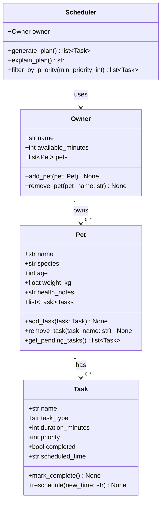

# PawPal+ Project Reflection

## 1. System Design

### Core User Actions

A PawPal+ user needs to be able to perform three primary actions:

1. **Add or manage a pet** — The owner enters their pet's profile (name, species, age, weight, and any health notes). This gives the system the context it needs to tailor and prioritize care tasks appropriately.

2. **Add or edit care tasks** — The owner creates tasks such as a morning walk, feeding, medication, grooming, or enrichment activities. Each task carries at minimum a duration (in minutes) and a priority level so the scheduler can rank and fit them into the day.

3. **Generate and view today's daily schedule** — The owner requests a daily care plan. The scheduler considers the total time available, task priorities, and any pet-specific constraints to produce an ordered plan and explain why it was arranged that way.

**a. Initial design**

The system is organized around four classes: `Owner`, `Pet`, `Task`, and `Scheduler`.

- **Owner** stores the owner's name and the number of minutes they have available in a day. It holds a list of `Pet` objects and exposes methods to add or remove pets.
- **Pet** stores the pet's profile (name, species, age, weight, health notes) and owns a list of `Task` objects. It can add or remove tasks and retrieve only the incomplete ones.
- **Task** (modeled as a Python dataclass) stores everything about a single care activity: its name, category (walk, feeding, meds, etc.), duration, priority, completion status, and assigned time slot. It can be marked complete or rescheduled.
- **Scheduler** holds a reference to the `Owner` and iterates over all pets and their tasks to produce a ranked, time-fitted daily plan. It exposes a method to explain its reasoning in plain language.

The key relationship is: an `Owner` has zero or more `Pet` objects; each `Pet` has zero or more `Task` objects; the `Scheduler` uses the `Owner` (and transitively its pets and tasks) to build the plan.

### Mermaid UML Class Diagram

**b. Design changes**

- Did your design change during implementation?
- If yes, describe at least one change and why you made it.

---

## 2. Scheduling Logic and Tradeoffs

**a. Constraints and priorities**

- What constraints does your scheduler consider (for example: time, priority, preferences)?
- How did you decide which constraints mattered most?

**b. Tradeoffs**

- Describe one tradeoff your scheduler makes.
- Why is that tradeoff reasonable for this scenario?

---

## 3. AI Collaboration

**a. How you used AI**

- How did you use AI tools during this project (for example: design brainstorming, debugging, refactoring)?
- What kinds of prompts or questions were most helpful?

**b. Judgment and verification**

- Describe one moment where you did not accept an AI suggestion as-is.
- How did you evaluate or verify what the AI suggested?

---

## 4. Testing and Verification

**a. What you tested**

- What behaviors did you test?
- Why were these tests important?

**b. Confidence**

- How confident are you that your scheduler works correctly?
- What edge cases would you test next if you had more time?

---

## 5. Reflection

**a. What went well**

- What part of this project are you most satisfied with?

**b. What you would improve**

- If you had another iteration, what would you improve or redesign?

**c. Key takeaway**

- What is one important thing you learned about designing systems or working with AI on this project?
