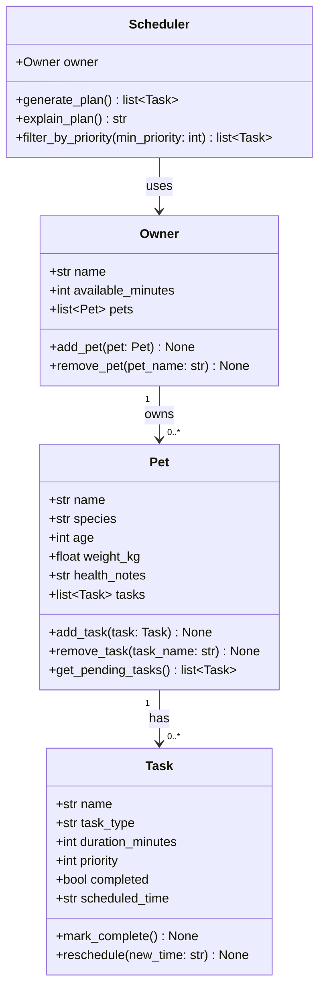
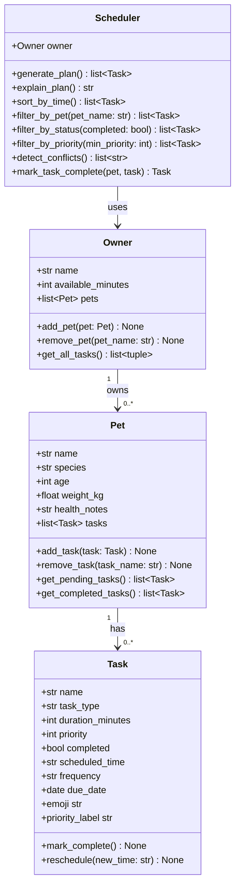

# PawPal+ Project Reflection

## 1. System Design

### Core User Actions

A PawPal+ user needs to be able to perform three primary actions:

1. **Add or manage a pet** — The owner enters their pet's profile (name, species, age, weight, and any health notes). This gives the system the context it needs to tailor and prioritize care tasks appropriately.

2. **Add or edit care tasks** — The owner creates tasks such as a morning walk, feeding, medication, grooming, or enrichment activities. Each task carries at minimum a duration (in minutes) and a priority level so the scheduler can rank and fit them into the day.

3. **Generate and view today's daily schedule** — The owner requests a daily care plan. The scheduler considers the total time available, task priorities, and any pet-specific constraints to produce an ordered plan and explain why it was arranged that way.

**a. Initial design**

The system is organized around four classes: `Owner`, `Pet`, `Task`, and `Scheduler`.

- **Owner** stores the owner's name and the number of minutes they have available in a day. It holds a list of `Pet` objects and exposes methods to add or remove pets.
- **Pet** stores the pet's profile (name, species, age, weight, health notes) and owns a list of `Task` objects. It can add or remove tasks and retrieve only the incomplete ones.
- **Task** (modeled as a Python dataclass) stores everything about a single care activity: its name, category (walk, feeding, meds, etc.), duration, priority, completion status, and assigned time slot. It can be marked complete or rescheduled.
- **Scheduler** holds a reference to the `Owner` and iterates over all pets and their tasks to produce a ranked, time-fitted daily plan. It exposes a method to explain its reasoning in plain language.

The key relationship is: an `Owner` has zero or more `Pet` objects; each `Pet` has zero or more `Task` objects; the `Scheduler` uses the `Owner` (and transitively its pets and tasks) to build the plan.

### Mermaid UML Class Diagram

**b. Design changes**

Yes — two changes emerged during implementation:

1. **`Task` gained `frequency` and `due_date` fields.** The initial skeleton only stored a `scheduled_time` string. Once recurring tasks became a requirement, two new attributes were needed: `frequency` ("once", "daily", or "weekly") and `due_date` (a `datetime.date`) so the scheduler could compute the next occurrence with `timedelta`. These were added to the dataclass with safe defaults so existing code didn't break.

2. **`Scheduler.generate_plan()` sort key changed.** The original stub sorted by `(-priority, duration_minutes)` — shortest task as a tiebreak. After implementing `sort_by_time()` it became clearer that `scheduled_time` should be the tiebreak within a priority band (so a morning P5 task comes before an evening P5 task). The key became `(-priority, scheduled_time is None, scheduled_time or "")`, which handles both timed and un-timed tasks cleanly.

The final UML reflecting these additions:

---

## 2. Scheduling Logic and Tradeoffs

**a. Constraints and priorities**

The scheduler considers two hard constraints:

- **Time budget** — the owner's `available_minutes` for the day. Tasks are placed greedily until the budget is exhausted; any task that wouldn't fit is skipped.
- **Task priority** — an integer from 1 (low) to 5 (critical). This is the primary sort key; the time slot is a secondary tiebreak within the same priority band.

Priority was treated as the most important constraint because the scenario is about a *busy* owner who cannot do everything — knowing which tasks are medically necessary (giving meds = P5) versus optional (enrichment play = P3) directly determines what gets dropped when time runs short.

**b. Tradeoffs**

The conflict detector uses **exact-time-slot matching** rather than overlap-duration checking. Two tasks at `08:00` are flagged as a conflict regardless of their durations; but a `08:00` 30-min task and an `08:20` 10-min task are not flagged even though they technically overlap.

This tradeoff is reasonable because most pet tasks are short and naturally spaced, owners tend to schedule at coarse intervals (on the hour or half-hour), and duration-overlap detection would require converting time strings to comparable numeric values and tracking blocking windows — significantly more complexity for little practical gain at this scale.

---

## 3. AI Collaboration

**a. How you used AI**

AI (GitHub Copilot) was used at every phase:

- **Design brainstorming** — Asked Copilot to generate a Mermaid class diagram from a plain-English description of the four classes, then reviewed and adjusted relationships.
- **Skeleton generation** — Used Agent mode to produce dataclass stubs from the UML, saving significant boilerplate.
- **Algorithm suggestions** — Asked Copilot "how should `sort_by_time` handle tasks with no time slot?" — the suggested lambda `(t.scheduled_time is None, t.scheduled_time or "")` was clean and directly adopted.
- **Test generation** — Used Copilot to draft pytest fixtures and test class structures, then manually added edge-case tests for recurrence and budget overflow.
- **Docstring pass** — Used the Generate Documentation action to add consistent one-line docstrings across all methods.

The most productive prompt pattern was: *"Given [specific method signature and docstring], implement this so that [precise behavioral requirement]."*

**b. Judgment and verification**

Copilot initially suggested that `mark_task_complete` should live on the `Task` class itself and recursively append the next task to `pet.tasks` via a back-reference to the `Pet`. This was rejected because:

- It creates a circular reference (`Task → Pet`), making the dataclass stateful in unexpected ways.
- The `Scheduler` is already the coordination layer; asking a `Task` to manage its own recurrence violates single-responsibility.

Instead, the method was placed on `Scheduler`, which already holds the `Owner` reference and can reach the correct `Pet` cleanly. The decision was verified by sketching the object graph and confirming that a `Task` should not need to know which `Pet` it belongs to.

---

## 4. Testing and Verification

**a. What you tested**

The suite (`tests/test_pawpal.py`) covers 15 tests across 5 test classes:

| Test class | What it verifies |
|------------|------------------|
| `TestTaskCompletion` | `mark_complete()` flips `completed` to `True` and is idempotent |
| `TestPetTaskManagement` | Adding/removing tasks changes count; `get_pending_tasks()` excludes completed |
| `TestSortByTime` | Tasks sorted chronologically; un-timed tasks placed last |
| `TestConflictDetection` | No warning when slots differ; warning returned for identical slots |
| `TestRecurringTasks` | Daily → +1 day; weekly → +7 days; once-off → no new task |
| `TestGeneratePlan` | Budget never exceeded; empty plan for no tasks; P5 before P1 |

These behaviors were prioritised because they represent the core intelligence of the system — incorrect scheduling logic or broken recurrence would silently fail without any visible error in the UI.

**b. Confidence**

**4 / 5 stars.** The happy paths and the main edge cases (empty task list, exact budget fit, recurring frequencies) are all covered and passing. Remaining gaps:

- Tasks with a duration *exactly equal* to `available_minutes` (boundary condition)
- Malformed time strings (e.g., `"8:0"` or `"25:61"`)
- An owner with no pets
- Concurrent calls in a multi-user Streamlit environment (session isolation)

---

## 5. Reflection

**a. What went well**

The part of this project I'm most satisfied with is the **separation of concerns between the logic layer and the UI**. Because all scheduling intelligence lives in `pawpal_system.py` and is tested independently via `main.py` and pytest, the Streamlit file (`app.py`) stayed thin — it only handles input gathering and display. This made debugging much faster: when a scheduling bug appeared, I could reproduce and fix it in the terminal without spinning up a browser. The 15-test suite confirmed correctness before any UI wiring began, which gave real confidence at each step.

**b. What you would improve**

If I had another iteration, I would redesign **data persistence**. Currently all pet and task data lives in `st.session_state` and is lost when the browser tab closes. Persisting to a local `data.json` file (or a lightweight SQLite database) would make the app genuinely useful day-to-day. I would also replace the simple greedy scheduler with a **weighted knapsack approach** that considers task urgency (time since last completed) in addition to static priority, so tasks that keep getting bumped eventually rise to the top automatically.

**c. Key takeaway**

The most important thing I learned is that **AI is a powerful first-draft engine, but the human has to own the architecture**. Copilot could quickly produce working code for any individual method, but it could not see the whole picture — it suggested putting recurrence logic inside `Task`, which would have created a messy circular dependency. The value of having a clear UML diagram upfront was that it gave me the authority to evaluate AI suggestions against an explicit design contract and reject the ones that violated it. The lead architect role is not about writing every line; it's about knowing when to say "that's not the right place for it."
